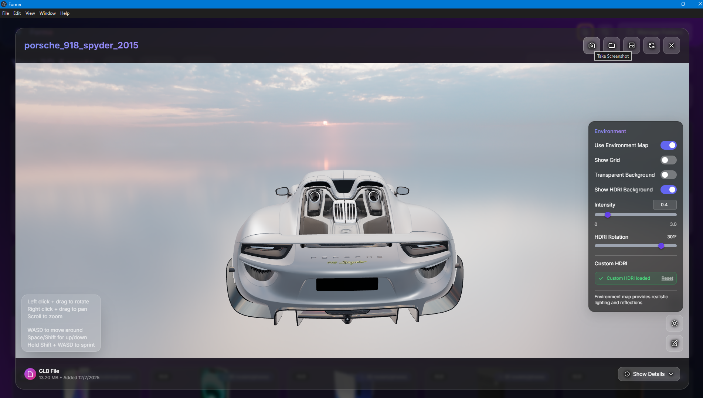
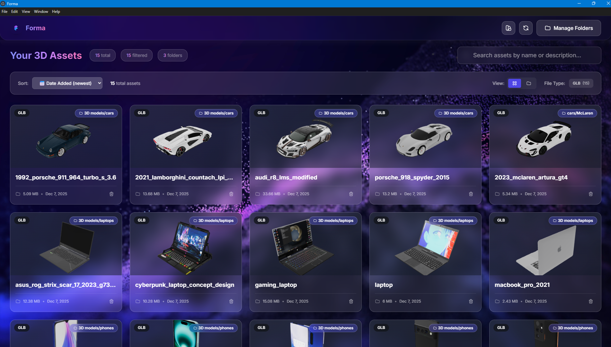
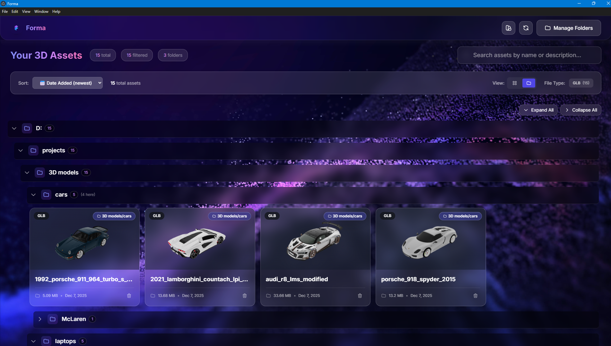
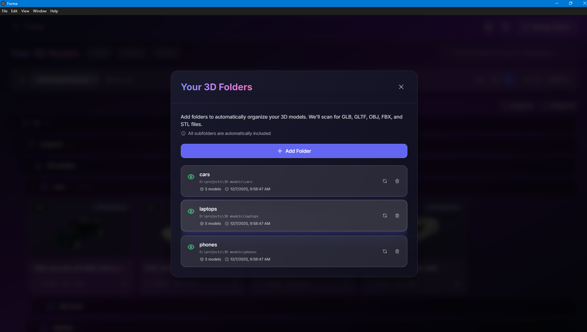
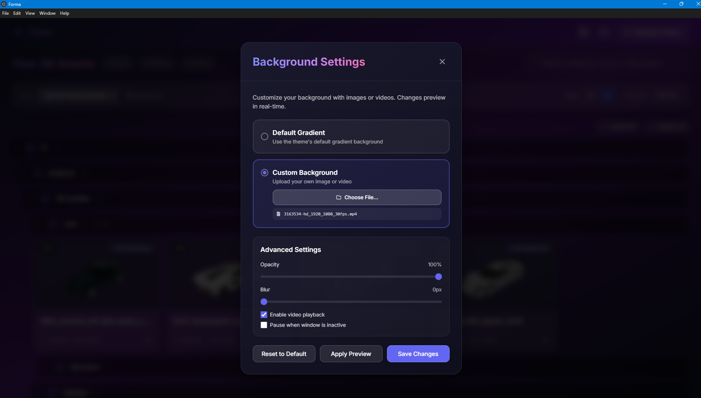

# Forma

> **A powerful desktop application for managing and previewing 3D models locally.**

Built with Electron, Svelte, and Three.js for Windows 10/11.


## Overview

**Forma** is a local-first desktop application designed for game developers, VFX artists, 3D designers, and anyone working with 3D models. It solves a simple but critical problem: **Windows doesn't show 3D model previews in File Explorer**.

Instead of uploading files to the cloud or opening each model in heavy 3D software, Forma automatically discovers, indexes, and previews your local 3D models with beautiful thumbnails and an interactive 3D viewer.

## Screenshots

### 3D Model Viewer with HDRI Environment


_Interactive 3D viewer with custom HDRI environment, showing a Porsche 918 Spyder model with realistic lighting and reflections_

### Asset Grid View


_Main interface showing asset grid with auto-generated thumbnails, search functionality, and filtering options_

### Tree View Organization


_Organize assets by folders with expandable tree view for easy navigation_

### Folder Management


_Add folders to automatically scan and index your 3D models - supports GLB, GLTF, OBJ, FBX, and STL formats_

### Background Customization


_Customize the app with images or videos as backgrounds, with adjustable opacity and blur controls_

## Features

### Core Features

- **Local File Indexing** - Automatically discovers 3D models in watched folders
- **Real-time 3D Preview** - Interactive viewer with orbit controls, lighting, and materials
- **Thumbnail Generation** - Automatic high-quality thumbnail creation with studio lighting
- **Folder Watching** - Auto-updates when files are added, modified, or removed
- **Multi-Format Support** - GLB, GLTF, OBJ, FBX, and STL files
- **Search & Organization** - Tag-based categorization and powerful search
- **Notes & Metadata** - Add descriptions with auto-save functionality
- **100% Offline** - Everything stays on your local machine, no uploads required
- **Fast Performance** - Direct file system access with SQLite database

### Advanced Features

- **Screenshot Export** - Capture 3D viewport at multiple resolutions (1080p, 2K, 4K)
- **Advanced HDRI System**
  - Upload custom HDRI environments (.hdr, .exr, .jpg, .png)
  - 360° HDRI rotation for perfect lighting angles
  - Granular intensity control (0.01 precision, 0-3.0 range with number input)
  - Auto-adjusts intensity for HDR/EXR files (default 0.4 vs 1.0 for standard)
  - Show HDRI as visible background or lighting-only
- **Camera & Animation**
  - Auto-rotation with adjustable speed (0.05-2.0°/frame)
  - Orbit controls with damping
  - Smart camera positioning based on model bounds
- **Environment Controls**
  - Transparent background for clean screenshots
  - Custom background colors with presets
  - Grid helper toggle
  - Dynamic card styling (adapts to light/dark backgrounds)
- **Customizable UI**
  - Three theme options: Neon (purple), Arctic (light), Graphite (dark)
  - Custom app backgrounds (images or videos)
  - Adjustable opacity and blur for backgrounds
  - Video backgrounds with playback controls
- **File Explorer Integration** - "Show in Explorer" to quickly locate files
- **Material Support** - Full PBR material rendering with textures
- **Geometry-Only Formats** - Special handling for formats without textures (OBJ, STL)
- **Technical Details** - View polygon count, vertices, meshes, materials, and texture stats

## Supported Formats

### 3D Model Formats

| Format   | Extension | Type                | Textures                   |
| -------- | --------- | ------------------- | -------------------------- |
| **GLB**  | `.glb`    | Binary GLTF         | ✅ Full support            |
| **GLTF** | `.gltf`   | Text GLTF (limited) | ⚠️ External files required |
| **OBJ**  | `.obj`    | Wavefront           | ⚠️ Geometry only           |
| **FBX**  | `.fbx`    | Autodesk            | ✅ Full support            |
| **STL**  | `.stl`    | Stereolithography   | ⚠️ Geometry only           |

### Environment/HDRI Formats

| Format      | Extension      | Type                    | Notes                              |
| ----------- | -------------- | ----------------------- | ---------------------------------- |
| **HDR**     | `.hdr`         | RGBE High Dynamic Range | ✅ Full support with rotation      |
| **EXR**     | `.exr`         | OpenEXR                 | ✅ Full support with rotation      |
| **JPG/PNG** | `.jpg`, `.png` | Standard Images         | ✅ Can be used as environment maps |

## Installation

### Prerequisites

- **Windows 10/11** (64-bit)
- **Node.js 18+** (for development only)

### For End Users

**Releases**: Coming soon - watch this repository for the first stable release

**Early Access**: Build from source using the instructions below

### For Developers

**Build from source:**

```bash
# Clone the repository
git clone https://github.com/MarkKatsDesign/3d-asset-manager.git
cd 3d-asset-manager/desktop

# Install dependencies
npm install

# Run in development mode
npm run dev
```

The application will launch automatically. On first run:

1. Click "Manage Folders" in the top-right
2. Select a directory containing 3D models (.glb, .obj, .fbx, .stl)
3. Forma will automatically scan and generate thumbnails
4. Click any asset to preview in 3D!

## Usage Guide

### Getting Started

1. **Add Folders** - Click "Manage Folders" to add directories containing 3D models
2. **Auto-Discovery** - The app will automatically scan and index all supported files
3. **Browse & Preview** - Click any asset card to view the 3D model with interactive controls
4. **Search & Filter** - Use the search bar and filter toolbar to find specific models
5. **Tree View** - Toggle tree view to organize assets by folder structure
6. **Manage Tags** - Add tags to categorize your assets
7. **Add Notes** - Write descriptions that auto-save for each asset

### 3D Viewer Controls

- **Orbit** - Left click + drag to rotate camera around model
- **Pan** - Right click + drag to move view
- **Zoom** - Scroll wheel to zoom in/out
- **Auto-Rotate** - Click rotate icon to enable automatic spinning with adjustable speed
- **Screenshot** - Capture high-quality renders at HD (1920x1080), 2K (2560x1440), or 4K (3840x2160)

### Environment & Lighting

1. **Upload Custom HDRI** - Click environment icon → Upload HDRI (.hdr, .exr, .jpg, .png)
2. **Adjust Intensity** - Use slider (0-3.0) or type exact value for precise control
3. **Rotate Environment** - Drag HDRI Rotation slider (0-360°) to find perfect lighting angle
4. **Background Options**
   - Toggle "Show HDRI Background" to display environment or use for lighting only
   - Toggle "Transparent Background" for clean screenshots with no background
   - Choose from 5 color presets or use custom color picker
   - Toggle grid helper for reference
5. **Technical Details** - Click "Show Details" to view polygon count, vertices, meshes, materials, and texture stats

### App Customization

- **Themes** - Choose from Neon (purple), Arctic (light), or Graphite (dark) themes
- **Custom Backgrounds** - Set images or videos as app backgrounds with opacity and blur controls
- **View Modes** - Switch between grid view and grouped tree view

## Development

### Build for Production

```bash
# Build renderer and main process
npm run build

# Package as Windows installer
npm run package:win
```

Output files will be in `release/` directory:

- `Forma Setup.exe` - NSIS installer
- `Forma.exe` - Portable executable

> **Note**: Icon files are currently placeholders. Custom icons will be added before the first release.

## Architecture

### Technology Stack

| Component             | Technology            | Purpose                     |
| --------------------- | --------------------- | --------------------------- |
| **Desktop Framework** | Electron 39.2.6       | Cross-platform desktop apps |
| **Frontend**          | Svelte 4.2.8          | Reactive UI framework       |
| **3D Engine**         | Three.js 0.160.0      | WebGL-based 3D rendering    |
| **Database**          | better-sqlite3 12.5.0 | Fast local storage          |
| **File Watching**     | chokidar 3.5.3        | File system monitoring      |
| **Build Tool**        | Vite 5.0.11           | Fast builds and HMR         |
| **Styling**           | Tailwind CSS 3.4.1    | Utility-first CSS           |

### Project Structure

```
desktop/
├── src/
│   ├── main/                   # Electron main process
│   │   ├── main.ts             # Application entry point
│   │   └── services/
│   │       ├── database.ts     # SQLite database service
│   │       ├── fileWatcher.ts  # Folder watching and auto-indexing
│   │       └── thumbnail.ts    # Thumbnail generation coordination
│   ├── preload/                # Secure IPC bridge
│   │   └── preload.ts          # Exposes safe APIs to renderer
│   ├── lib/                    # Svelte UI components
│   │   ├── components/
│   │   │   ├── AssetViewer.svelte          # 3D viewer with Three.js
│   │   │   ├── AssetCard.svelte            # Thumbnail cards
│   │   │   ├── AssetGrid.svelte            # Grid layout
│   │   │   ├── GroupedAssetGrid.svelte     # Tree view with grouped assets
│   │   │   ├── FolderManager.svelte        # Folder management
│   │   │   ├── SearchBar.svelte            # Search functionality
│   │   │   ├── FilterToolbar.svelte        # Tag filtering
│   │   │   ├── Navbar.svelte               # Top navigation bar
│   │   │   ├── ThemeSwitcher.svelte        # Theme selection
│   │   │   └── BackgroundCustomizer.svelte # Background customization
│   │   ├── stores/
│   │   │   ├── localAssetStore.js          # Asset state management
│   │   │   ├── folderStore.js              # Folder state management
│   │   │   └── themeStore.js               # Theme state management
│   │   └── utils/
│   │       └── thumbnailGenerator.js       # Client-side thumbnail generation
│   ├── App.svelte              # Main application component
│   ├── app.css                 # Global styles
│   ├── main.ts                 # Renderer process entry
│   └── main.js                 # Renderer process entry (JS)
├── scripts/
│   ├── dev.mjs                 # Development server script
│   └── generate-icon.mjs       # Icon generation utility
├── resources/
│   ├── icon.ico                # Windows application icon
│   └── icon.png                # Source icon image
├── index.html                  # HTML entry point
├── package.json                # Dependencies and scripts
├── vite.config.ts              # Vite build configuration
├── tsconfig.json               # TypeScript configuration
├── tsconfig.electron.json      # Electron-specific TypeScript config
├── tailwind.config.js          # Tailwind CSS configuration
├── postcss.config.js           # PostCSS configuration
└── svelte.config.js            # Svelte configuration
```

### Data Storage

- **Database Location**: `%APPDATA%/forma-desktop/assets.db`
  - Windows: `C:\Users\<YourName>\AppData\Roaming\forma-desktop\assets.db`
- **Schema**:
  - `assets` - Model metadata (name, path, tags, description)
  - `thumbnails` - Generated preview images (BLOB)
  - `watched_folders` - Monitored directories

## Use Cases

- **Game Development** - Manage game assets and character models
- **VFX & Animation** - Organize production assets
- **3D Printing** - Preview and catalog STL files
- **Architecture** - Browse architectural models
- **Education** - Create 3D model libraries for courses
- **Product Design** - Manage product prototypes and variants

## Roadmap

- [ ] macOS and Linux support
- [ ] Batch operations (rename, tag multiple assets)
- [ ] Collection/project organization
- [ ] Import/export asset catalogs
- [ ] Asset comparison view (side-by-side)
- [ ] Animation playback for animated GLTF/GLB models
- [ ] Optional cloud backup feature

## Contributing

Contributions are welcome! Please feel free to submit a Pull Request.

1. Fork the repository
2. Create your feature branch (`git checkout -b feature/AmazingFeature`)
3. Commit your changes (`git commit -m 'Add some AmazingFeature'`)
4. Push to the branch (`git push origin feature/AmazingFeature`)
5. Open a Pull Request

**Note**: All contributions must be licensed under GPL v3 to maintain the project's copyleft protection.

## License

This project is licensed under the **GNU General Public License v3.0** - see the [LICENSE](./LICENSE) file for details.

### What This Means:

✅ **You can:**

- Use this software for free (personal or commercial)
- Modify and improve the code
- Distribute it to others
- Study how it works

⚠️ **BUT you must:**

- Keep it open-source (GPL v3)
- Share your source code if you distribute modified versions
- Include the original copyright notice
- License your modifications under GPL v3

❌ **You cannot:**

- Make a proprietary/closed-source version
- Remove or change the license
- Use it without providing source code access

### Why GPL v3?

This license protects the project from commercial exploitation while ensuring it remains free and open for everyone. Any improvements or derivatives must also be open-source, benefiting the entire community.

For the complete license text, see: https://www.gnu.org/licenses/gpl-3.0.html

## Author

**Mark Kats**

- GitHub: [@MarkKatsDesign](https://github.com/MarkKatsDesign)
- LinkedIn: [linkedin.com/in/mark-kats](https://www.linkedin.com/in/mark-kats/)

---

## Support This Project

If you find **Forma** useful and want to support its development, consider buying me a coffee or becoming a sponsor! Your support helps keep this project alive and maintained.

[](https://ko-fi.com/markkats)
[](https://github.com/sponsors/MarkKatsDesign)

**Ways to support:**
- ☕ [Buy me a coffee on Ko-fi](https://ko-fi.com/markkats) - One-time donations
- 💝 [Become a GitHub Sponsor](https://github.com/sponsors/MarkKatsDesign) - Monthly support with exclusive benefits

Every contribution, no matter how small, is greatly appreciated and helps maintain this free and open-source project!

---

## Credits

This project's documentation and screenshots feature high-quality 3D models and media created by talented artists from the community. **These assets are used solely for demonstration purposes** in the README and are not included in the repository or distributed with the application. All assets are used under their respective free licenses.

### 3D Models

**Cars:**

- [Porsche 918 Spyder 2015](https://sketchfab.com/3d-models/porsche-918-spyder-2015-wwwvecarzcom-9fb9a088d0704a06ba69a8a6de100f10) by [vecarz](https://sketchfab.com/heynic) on Sketchfab
- [1992 Porsche 911 (964) Turbo S 3.6](https://sketchfab.com/3d-models/1992-porsche-911-964-turbo-s-36-27240ad1a825434f99e980d7c904c3d0) by [Ddiaz Design](https://sketchfab.com/ddiaz-design) on Sketchfab
- [2021 Lamborghini Countach LPI 800-4](https://sketchfab.com/3d-models/2021-lamborghini-countach-lpi-800-4-d76b94884432422b966d1a7f8815afb5) by [Lexyc16](https://sketchfab.com/Lexyc16) on Sketchfab
- [Audi R8 LMS Modified](https://sketchfab.com/3d-models/audi-r8-lms-modified-d6445579e4a648879d61b9426d13d30e) by [MattsActuallyUsefulModels](https://sketchfab.com/MattsActuallyUsefulModels) on Sketchfab
- [2023 McLaren Artura GT4](https://sketchfab.com/3d-models/2023-mclaren-artura-gt4-13fe32f1216147a8853084be1afa540e) by [Ddiaz Design](https://sketchfab.com/ddiaz-design) on Sketchfab

**Laptops:**

- [Asus ROG Strix Scar 17 (2023) G733 Gaming Laptop](https://sketchfab.com/3d-models/asus-rog-strix-scar-17-2023-g733-gaming-laptop-51eca7b2e5884c4087f3499e523d5184) by [Ranaha Creative Studio](https://sketchfab.com/ranahacs) on Sketchfab
- [CyberPunk Laptop Concept Design](https://sketchfab.com/3d-models/cyberpunk-laptop-concept-design-fddc4e68cc6c498b88b19af1a05bd420) by [Berk Gedik](https://sketchfab.com/berkgedik) on Sketchfab
- [Gaming Laptop](https://sketchfab.com/3d-models/gaming-laptop-4e72a2078b3c4a75a821ab09830693fe) by [Vivien Deroche](https://sketchfab.com/blue-odym) on Sketchfab
- [Laptop](https://sketchfab.com/3d-models/laptop-f34c1400926e430a9ef10bb180986b42) by [Red Fox](https://sketchfab.com/nokillnando) on Sketchfab
- [MacBook Pro 2021](https://sketchfab.com/3d-models/macbook-pro-2021-37763335f74b497e91906986b170b5d1) by [KangaroOz 3D](https://sketchfab.com/KangaroOz-3D) on Sketchfab

**Smartphones:**

- [Low Poly Phone Xiaomi Redmi Note 8T](https://sketchfab.com/3d-models/low-poly-phone-xiaomi-redmi-note-8t-2eda2e9440874b1cb5fc70a6fd282ee3) by [hueta.wrks](https://sketchfab.com/hueta.wrks) on Sketchfab
- [iPhone 17 Pro](https://sketchfab.com/3d-models/iphone-17-pro-4aeeeb41f9d14f96bb3f2589edc3edac) by [Ibrahim.Bhl](https://sketchfab.com/ibrahim.bhl) on Sketchfab
- [One Plus 7 Pro](https://sketchfab.com/3d-models/one-plus-7-pro-6dea856656e04a4b89fef3c2572ee238) by [lazercar](https://sketchfab.com/lazercar) on Sketchfab
- [Google Pixel 6 Pro](https://sketchfab.com/3d-models/google-pixel-6-pro-b9b58ca40c254f8dafd8370869af74fb) by [DatSketch](https://sketchfab.com/DatSketch) on Sketchfab
- [Samsung Galaxy S21 Ultra](https://sketchfab.com/3d-models/samsung-galaxy-s21-ultra-cd962832be7744efb6b37fe0ee2027e7) by [DatSketch](https://sketchfab.com/DatSketch) on Sketchfab

### Video Backgrounds

- [Changes in Form and Appearance of a Submerged Material](https://www.pexels.com/video/changes-in-form-and-appearance-of-a-submerged-material-3163534/) by [Oleg Gamulinskii](https://www.pexels.com/@oleg-gamulinskii-755060/) on Pexels
- [Waving Blue Particles](https://www.pexels.com/video/waving-blue-particles-12920671/) by [Crazy Motions](https://www.pexels.com/@crazy-motions-80195021/) on Pexels
- [Lava River from a Volcanic Eruption in Iceland](https://www.pexels.com/video/lava-river-from-a-volcanic-eruption-in-iceland-17675069/) by [Gylfi Gylfason](https://www.pexels.com/@just-icelandic/) on Pexels
- [Planet](https://www.pexels.com/video/planet-856857/) by [Pixabay](https://www.pexels.com/@pixabay/) on Pexels

**Thank you to all these amazing creators for making their work available to the community!**

---

## Legacy Web Application

This repository originally contained a web-based version of this 3D asset management tool. The web application files are preserved in:

- `frontend/` - Svelte web application
- `backend/` - PocketBase backend
- `docs/legacy/` - Web app documentation

The project has shifted focus to **Forma**, the desktop application, for better performance, privacy, and offline capabilities.

---

⭐ **Star this repo** if you find it useful!

_Built with Electron, Svelte, and Three.js_
